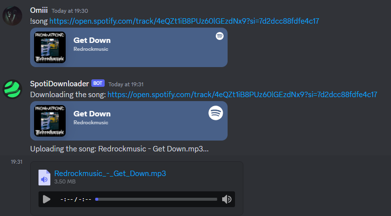

# SpotiDL Readme

  

Welcome to SpotiDL, a powerful and user-friendly software program designed to enhance your Spotify experience by allowing you to download playlists and songs with ease. Whether you want to enjoy your favorite music offline or maintain a personal collection, SpotiDL has got you covered.

## Connect on Discord for support and try out my own custom SpotiDL Discord bot! [Discord Server](https://discord.gg/dG2gdxWHJp)

Join our vibrant Discord community to unlock the complete potential of SpotiDL, including a powerful Discord bot that can download songs and playlists! Engage with fellow users, discover more software offerings, and access dedicated support for any troubleshooting or bug-related queries.

## Discord Version

  

## Discord Bot's features:
- Ability to download SoundCloud songs
- Ability to download Spotify albums
- Ability to download Spotify playlists & more
- Downloads music with metadata
- Queue System
- Music quality 320k

[view all features](https://sites.google.com/view/spotidownloader/home#h.7po3tvbei5y)

## GUI Features
**The GUI will have future updates**

SpotiDL comes packed with a range of features to meet your music downloading needs:

### 1. Download Full Playlists

With SpotiDL, you can effortlessly download entire playlists from your Spotify account. Whether it's a carefully curated collection or a dynamic mix, SpotiDL ensures you have your favorite playlists available offline.

### 2. Download Songs

Don't limit yourself to just playlists - download individual songs as well. SpotiDL enables you to grab specific tracks from Spotify, giving you the freedom to build your music library exactly how you want it.

### 3. High-Quality Downloads

We understand the importance of audio quality. SpotiDL lets you download your music in high quality (320k), ensuring that you enjoy your favorite tunes with the best sound possible.

### 4. Download All Your Liked Songs

If you've been diligently liking songs on Spotify, SpotiDL can help you download all those liked tracks in one go. Say goodbye to the hassle of searching for each song individually - SpotiDL streamlines the process for you.

## Getting Started

Follow these steps to get started with SpotiDL:

1. **Installation:** Download and install SpotiDL from the [official website](https://sites.google.com/view/spotidownloader/home).

2. **Authentication:** SpotiDL needs your Spotify account to access your playlists, liked songs, and more. After installation, log in to your Spotify account within the SpotiDL app.

3. **Select Your Content:** Choose the playlists, songs, or liked tracks you want to download using SpotiDL's GUI.

4. **Start Downloading:** Hit the download button and watch as SpotiDL works its magic, grabbing your selected content and saving it to your designated storage location.

5. **Enjoy Your Music:** Once downloaded, your music is ready for offline listening. Play it on your favorite media player, device, or wherever you prefer.

## Contributions and Issues

SpotiDL is an open-source project, and contributions from the community are highly appreciated. If you find a bug, have an idea for an improvement, or want to contribute in any way, please check out our [GitHub repository](https://github.com/OmiiiDev/SpotifyDL) for more information.

## Support

For any questions, troubleshooting, or feedback, feel free to contact our support team at redrockstudiosz7@gmail.com . We're here to help you get the most out of SpotiDL.

## License

SpotiDL is released under an All Rights Reserved license. The source code is not available for modification or distribution. You can use SpotiDL solely for personal use and enjoyment of your Spotify content.

---

Thank you for choosing SpotiDL to enhance your Spotify experience. We hope you enjoy the convenience and flexibility it brings to your music collection. Happy downloading!
